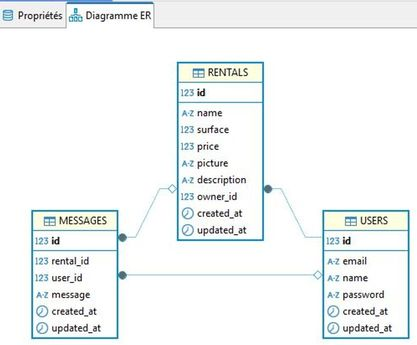

# Projet P3 Backend Spring pour :


## Table des matières

- [Description du projet](#description-du-projet)
- [Installation de la base de données](#installation-de-la-base-de-donnees)
- [Installation et lancement du projet](#installation-et-lancement-du-projet)
- [URL de la documentation Swagger](#url-de-la-documentation-swagger)
- [Chargement du front-end correspondant](#chargement-du-front-end-correspondant)
- [Alternative : Tester le backend avec Postman](#alternative--tester-le-backend-avec-postman)
- [Remarques](#remarques)
- [Auteur et contributeur](#auteur-et-contributeur)

## Auteur et dépôts
- Auteur : Christophe Pierrès
- Dans le cadre du projet N°3 d'OpenClassrooms (premier projet Backend), en vue d'obtenir la certification **Expert en développement logiciel**. Plus d'informations disponibles [ici](https://www.francecompetences.fr/recherche/rncp/36912/)
- Dépôt GitHub du backend : https://github.com/cpierres/P3-back-spring 
- Dépôt Github pour le frontend correspondant : https://github.com/cpierres/P3-front-angular (fork depuis OpenClassrooms)

## Description du projet
Gère le backend d'un site internet de location immobilière rapprochant les propriétaires et les demandeurs.
Il s'agit du projet 3 dans le cadre de la certification OpenClassrooms, pour le client Chatop.

## Installation de la base de données
Cette section explique comment installer et configurer la base de données MySQL pour un poste de développeur.

### Étape 1 : Configuration de Docker
Créez une container Docker contenant MySQL à l'aide du fichier `docker-compose.yml` suivant :

```yaml
version: '3.8'

services:
  mysql:
    image: mysql:8
    container_name: mysql8_opencr_projet03_container
    environment:
      MYSQL_ROOT_PASSWORD: opencr_pw_root
      MYSQL_DATABASE: opencr_db_prj03
      MYSQL_USER: opencr_user
      MYSQL_PASSWORD: opencr_pw1!
    volumes:
      - /volume1/docker/mysql8_opencr_projet03/data:/var/lib/mysql
    ports:
      - 3311:3306
```

### Étape 2 : Initialisation de la base de données
1. Montez le conteneur Docker avec la commande suivante dans le répertoire contenant `docker-compose.yml` :
   ```bash
   docker-compose up -d
   ```
2. Une fois le conteneur démarré, exécutez les scripts suivants dans l'ordre avec le mot de passe root de la base de données :
    - **`db/create_db.sql`** : Initialise la base de données, crée l'utilisateur et configure ses droits pour l'application.
    - **`db/init_schema.sql`** : Génère le schéma de la base de données.

Utilisez un client SQL (comme MySQL Workbench) ou un shell MySQL pour exécuter ces scripts.

La structure de la DB est celle-ci :



---

## Installation et lancement du projet

### Étape 1 : Configuration des variables d'environnement
Ajoutez les variables d'environnement suivantes à votre système :
- **`P3_JWT_SECRET_KEY`** : Génère une clé HS256 pour la gestion des tokens.  
  Vous pouvez générer cette clé avec la classe utilitaire suivante :
  ```java
  package com.cpierres.p3backspring.utils;

  import io.jsonwebtoken.SignatureAlgorithm;
  import io.jsonwebtoken.security.Keys;

  import javax.crypto.SecretKey;

  public class SecretKeyGenerator {
      public static void main(String[] args) {
          // Génère une clé secrète pour HS256
          SecretKey secretKey = Keys.secretKeyFor(SignatureAlgorithm.HS256);

          // Affiche la clé sous forme encodée (base64)
          String base64EncodedKey = java.util.Base64.getEncoder().encodeToString(secretKey.getEncoded());
          System.out.println("Clé secrète pour HS256 (encodée en Base64) : " + base64EncodedKey);
      }
  }
  ```
  Copiez la clé encodée en base64 et assignez-la à `JWT_SECRET_KEY`.

- **`P3_JWT_EXPIRATION_TIME`** : temps en millisecondes pour expiration du token (3600 par défaut) 

- **`P3_DB_URL`** : URL de connexion à la base de données.  
  Exemple :
  ```
  jdbc:mysql://localhost:3311/opencr_db_prj03
  ```

- **`P3_DB_USER`** : Nom de l'utilisateur créé pour l'application (exemple : `opencr_user`).

- **`P3_DB_PASSWORD`** : Mot de passe de l'utilisateur (exemple : `opencr_pw1!`).

- **`P3_PORT`** : Port du backend (par défaut : `3001`). Doit être en adéquation avec le frontend.

### Étape 2 : Lancement du backend
1. Assurez-vous que les variables d'environnement sont correctement définies.
2. Exécutez la commande suivante pour démarrer l'application :
   ```bash
   ./mvnw spring-boot:run
   ```
   (ou utilisez simplement votre IDE, comme IntelliJ IDEA, pour lancer le projet directement.)

3. L'application sera disponible à l'adresse suivante :  
   `http://localhost:3001` (ou le port configuré dans votre `application.properties`).

---

## URL de la documentation Swagger
La documentation Swagger est disponible à l'URL suivante :  
`http://localhost:{PORT}/swagger-ui/index.html`  
Remplacez `{PORT}` par le port configuré pour votre application (par défaut : 3001).

---

## Chargement du front-end correspondant
Ce projet backend est lié à un projet Angular pour la partie front-end. Suivez ces étapes pour configurer et exécuter le front-end.

### Étape 1 : Cloner le dépôt angular
Clonez le projet Angular à partir du dépôt Git suivant :
```bash
git clone https://github.com/cpierres/P3-front-angular
```

### Étape 2 : Installation des dépendances du front-end
1. Accédez au dossier du projet cloné :
   ```bash
   cd P3-front-angular
   ```
2. Installez les dépendances Angular à l'aide de npm :
   ```bash
   npm install
   ```

### Étape 3 : Configurer le fichier `environment.ts`
1. Dans le dossier `src/environments`, ouvrez ou créez le fichier `environment.ts`.
2. Configurez l'URL de l'API backend correspondante à votre projet (par défaut, `http://localhost:3001`).

Exemple de configuration :
```typescript
export const environment = {
  production: false,
  apiUrl: 'http://localhost:3001', // Remplacez par l'URL réelle du backend si différente.
};
```

### Étape 4 : Démarrer le serveur de développement Angular
Démarrez le front-end Angular avec la commande suivante :
```bash
npm run start
```

Le front sera accessible à l'URL suivante :  
`http://localhost:4200`  
Ce front doit être connecté au back-end pour l'utiliser.

Pour une application nouvellement installée, nous vous conseillons d'utiliser la fonctionnalité `Register` 
afin de créer un utilisateur. La connexion sera alors effectuée dans la foulée.

---
## Alternative : Tester le backend avec Postman
Vous pouvez tester facilement le backend à l'aide de Postman en important une collection prédéfinie.

### Étape 1 : Localiser la collection Postman
Le fichier de collection Postman se trouve dans le répertoire suivant du projet :  
`resources/postman/rental.postman_collection.json`

### Étape 2 : Importer la collection dans Postman
1. Ouvrez Postman.
2. Cliquez sur le bouton **Importer** dans l'interface.
3. Sélectionnez le fichier `rental.postman_collection.json` depuis le chemin indiqué ci-dessus.
4. Postman ajoutera alors les requêtes disponibles dans cette collection.

### Étape 3 : Authentification 
Appel de GET /api/auth/register pour vous inscrire en tant qu'utilisateur
Si déjà inscrit, Appel de GET /api/auth/login  
Après le succès de l'authentification, setter le token de la réponse vers la variable d'environnement `{{token-value}}`

### Étape 4 : Exécuter les requêtes
Vous pouvez maintenant exécuter les requêtes pour tester les endpoints du backend. 
Chaque requête inclut les headers, les body, et l'authentification nécessaires.

---

## Remarques
- **Docker** : Assurez-vous que Docker est correctement installé et en cours d'exécution.
- **MySQL Scripts** : les scripts SQL `create_db.sql` et `init_schema.sql` se trouvent dans le dossier `db/`.
- **Front/Back** : Veillez à ce que les ports et les URLs des deux projets soient correctement synchronisés.

---
## Auteur et contributeur

- [Christophe Pierrès](https://github.com/cpierres)
- Rachid Oubraim, mentor d'OpenClassrooms

---
Bonne utilisation du projet !